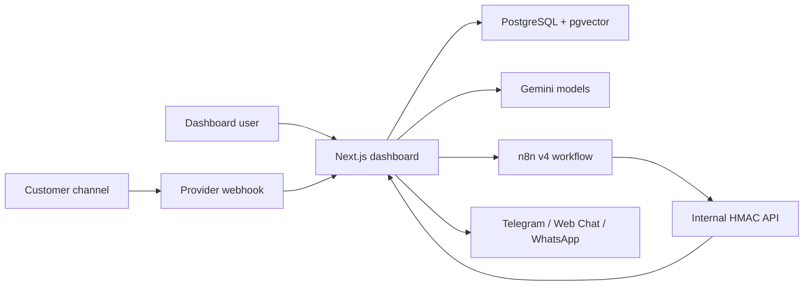

# ReplyOps AI

ReplyOps AI is a multi-tenant customer operations dashboard for AI-assisted support, knowledge-grounded replies, human handoff, action approvals, follow-ups, analytics, and channel orchestration.

The product is built for small teams that need AI automation without losing control of live customer conversations. It keeps provider-live acceptance separate from internally verified software readiness.

## Capabilities

- ABUD-branded dark/light dashboard with English and Arabic dashboard localization, RTL runtime sync, and page guides.
- Tenant-scoped businesses, assistant configuration, knowledge sources, catalog data, channel setup, inbox, handoffs, actions, follow-ups, analytics, audit logs, and system health.
- Tenant onboarding progress stored in ReplyOps-owned tenant metadata, with validation, resume, skip, and replay state.
- Knowledge/RAG flow for manual text, files, chunking, embeddings, retrieval, and grounded response generation.
- Telegram, Web Chat, and WhatsApp software paths with encrypted credential storage and webhook contracts.
- Web Chat embed behavior includes origin allowlist enforcement, blocked-origin safe errors, optional customer profile persistence, rate limiting, keyboard/focus labels, and reconnectable anonymous sessions.
- WhatsApp software contracts include signed raw-body webhook validation, inbound media metadata, delivery callbacks, 24-hour service-window and approved-template controls, opt-in/opt-out, quiet-hours and limit policy helpers, and credential redaction.
- Production final-acceptance harness creates QA-prefixed temporary tenants and records, runs Web Chat, WhatsApp mock-provider, Actions, Follow-ups, Analytics, Onboarding, and Telegram replay matrices, then proves cleanup.
- n8n v4 runtime workflow contract with internal HMAC signing and structured failure normalization.
- RBAC, tenant isolation checks, CSRF protection, rate limiting, SSRF-aware outbound action controls, redirected final-host validation, bounded connector responses, audit logging, and secret redaction discipline.

## Architecture



## Stack

- Next.js App Router
- React
- TypeScript
- Prisma
- PostgreSQL with pgvector
- NextAuth
- n8n
- Gemini API
- Node test runner
- ESLint
- GitHub Actions

## Local Setup

1. Copy placeholders:

```bash
cp .env.example .env
```

2. Replace local values in `.env`. Never use production secrets in local demos or public logs.

3. Start PostgreSQL with pgvector on port `5433`.

4. Install and prepare:

```bash
npm ci
npx prisma generate
npx prisma migrate deploy
```

The default Prisma config uses `prisma/migrations_clean`, a clean baseline for new installs and CI.
Existing production deployments keep their applied legacy migration history via:

```bash
npx prisma migrate deploy --config prisma.production.config.ts
npx prisma migrate status --config prisma.production.config.ts
```

5. Run:

```bash
npm run dev
```

Open `http://localhost:3000`.

## Environment

`.env.example` groups placeholder values for:

- application URLs and ports
- database
- authentication
- encryption
- Gemini
- Telegram
- WhatsApp
- n8n
- internal HMAC
- deployment
- optional debug flags

Required provider-live values are issued by the relevant provider. Mocked software tests must not be reported as provider-live acceptance.

## n8n

Workflow exports live in `n8n/`. The v4 runtime workflow calls protected internal APIs using HMAC headers and must not contain hardcoded tenant IDs, tokens, or provider secrets.

The reusable signed matrix harness is `scripts/n8n-v4-signed-matrix.mjs`. It requires QA tenant/channel environment values and prints sanitized pass/fail JSON only.

## Testing

```bash
npx prisma format
npx prisma validate
npx prisma generate
npx prisma migrate deploy
npx prisma migrate status
npm run typecheck
npm run lint
npm test
npm run test:integration
npm run build
npm run test:e2e
npm run secret-scan
npm audit --omit=dev
```

The Playwright suite includes an authenticated dashboard route matrix across 19 routes, 6 viewports, English/Arabic, and dark/light modes. It writes sanitized screenshots and `scratch/visual-qa/dashboard-route-matrix.json`; `scratch/` remains ignored.

The smoke suite includes deterministic source-contract matrices for Web Chat embed behavior, WhatsApp mocked-provider controls, Action approval/SSRF controls, Follow-up scheduling and claim logic, Analytics calculations, and Onboarding progress state. Provider-live checks still require real provider evidence.

Production acceptance harness:

```bash
node scripts/production-final-acceptance.mjs
```

Run it only against an intended environment with a valid `DATABASE_URL` and `REPLYOPS_CREDENTIALS_ENCRYPTION_KEY`. Results are sanitized and written outside committed source by default.

Provider-live checks, browser screenshots, production deployment verification, and restart persistence are tracked in `STATUS.md`.

## Deployment

Production deployment uses immutable release directories:

- build a new release directory
- link shared environment and uploads
- run migrations and verification inside the release
- use `prisma.production.config.ts` for existing production migration history
- precheck on a spare port
- switch the `current` symlink only after checks pass
- restart the single ReplyOps PM2 process

Do not commit deployment archives, backups, dumps, upload contents, or environment files.

## Security Model

- Credentials are encrypted at rest.
- Internal automation traffic is signed with HMAC and replay-protected.
- RBAC limits platform-owner, tenant-owner, admin, agent, and viewer capabilities.
- Tenant data is scoped by membership and tenant IDs.
- Outbound HTTP actions require allowlisted domains and SSRF checks.
- Audit logs record protected mutations without exposing secrets.

See `SECURITY.md` for reporting and local safety checks.

## Current Status

`STATUS.md` is the operational source of truth for readiness percentages, verified checks, active release, rollback, external blockers, and exact manual actions.

Known external acceptance remains separate from internal software completion, especially Telegram real-user sequences and WhatsApp provider-live validation.

## Contributing

Read `CONTRIBUTING.md`, run the quality gate, and keep PRs free of secrets, customer data, logs, dumps, and production backups.
